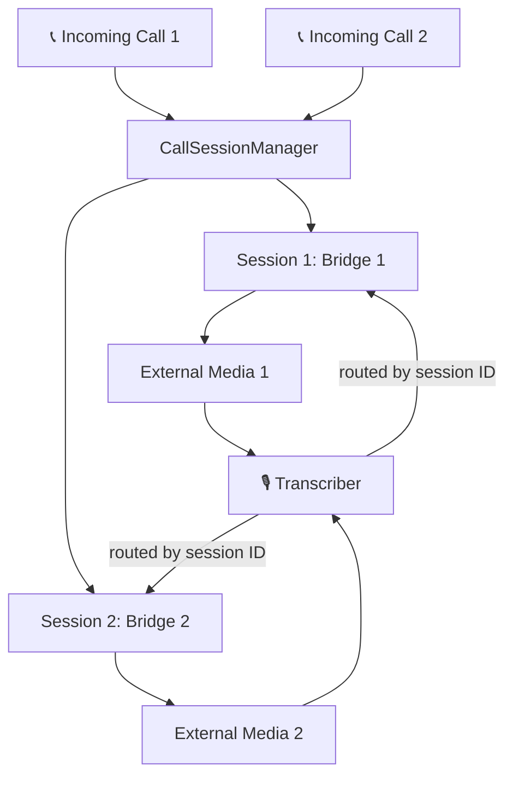

# 📞 VoiceFlow (ARI Stasi Server)

[](https://www.typescriptlang.org/)
[](https://nodejs.org/)
[](https://wiki.asterisk.org/wiki/display/AST/Asterisk+REST+Interface+(ARI))
[](LICENSE)

<p align="center">
  <!-- Replace with your own logo when available -->
  
  <br>
  <em><a href="https://asterisk.org"></a>-powered telephony management with speech recognition and transcription</em>
</p>

---

## 📋 Overview

TranscriptARI is a sophisticated telephony management system built on Asterisk's ARI (Asterisk REST Interface). It provides voice call handling, transcription, and PBX control capabilities. The system combines WebSockets, RTP, and Google Speech-to-Text integration to create a modern, feature-rich telephony solution.

## ✨ Key Features

- 🔄 **Call Management** - Handles incoming and outgoing calls through Asterisk PBX
- 🎙️ **Speech-to-Text** - Real-time transcription using local AI models (Parakeet, Whisper) or Google Cloud
- 🌉 **Bridge Management** - Creates and manages voice bridges for connecting multiple channels
- 👥 **Contact Recognition** - Supports voice-activated dialing using a contacts database
- 📡 **External Media Channels** - Supports external media integration for advanced use cases
- 🔌 **WebSocket Interface** - Provides real-time updates and control via WebSockets
- 🔁 **Automatic Fallback** - Seamlessly switches to backup transcription services if primary fails

## 🏗️ Architecture

The system is built on TypeScript and Node.js with a modular architecture supporting **multiple concurrent calls**:



### Core Components

<details>
<summary><b>🎮 AriControllerServer</b></summary>
<p>

The main controller that interfaces with Asterisk PBX:
- Manages call flows, bridges, and DTMF input
- Handles Stasis application events (start, end)
- Provides WebSocket server for client connections
- Manages contact lookups for voice-activated dialing

</p>
</details>

<details>
<summary><b>🔤 AriTranscriberServer</b></summary>
<p>

Provides real-time speech transcription:
- Connects to configurable transcription services (local or cloud)
- Processes RTP audio streams
- Transmits transcription results via WebSockets
- Supports customizable language and model settings
- Automatic fallback to backup services on failure

</p>
</details>

<details>
<summary><b>📡 RTP UDP Server</b></summary>
<p>

Handles the real-time audio streaming:
- Processes incoming RTP packets from Asterisk
- Handles audio format conversion for transcription

</p>
</details>

<details>
<summary><b>🗣️ Transcription Providers</b></summary>
<p>

Multiple transcription backend support:
- **Local providers**: Parakeet TDT, Whisper (runs on your GPU)
- **Cloud provider**: Google Speech-to-Text API (optional)
- Handles streaming transcription with automatic restarts
- Manages audio chunking for optimal performance
- Provides both interim and final transcription results
- Automatic failover between services

</p>
</details>

## ⚙️ Configuration

The system uses environment variables for configuration, including:

| Category | Variables |
|----------|-----------|
| PBX | PBX IP address, login credentials |
| WebSocket | Server ports, external host information |
| Transcription | Language settings, model configuration |
| Telephony | Provider settings, phone numbers |

## 🚀 Getting Started


### Prerequisites

1. **Set up FreePBX server** - [FreePBX Server Installation and Configuration Guide](freepbx-setup.md)
2. **Install UV** (Python package manager):
   ```powershell
   # Windows PowerShell
   irm https://astral.sh/uv/install.ps1 | iex
   ```

### Installation

1. **Setup Transcription Service** (local speech recognition):

   **Parakeet (Recommended - fastest):**
   ```bash
   cd transcription-services/parakeet-service
   uv venv
   uv pip install -r requirements.txt
   ```

   **OR Whisper (alternative):**
   ```bash
   cd transcription-services/whisper-service
   uv venv
   uv pip install -r requirements.txt
   ```

2. **Configure environment variables** in `.env` file:
   ```env
   TRANSCRIPTION_SERVICES=ws://localhost:5000
   ```
   See [`.env.example`](.env.example) for all options and fallback configuration.

3. **Configure contacts** in `tools/contacts.json` for voice-activated dialing

### Running the System

1. **Start Transcription Service** (in terminal 1):

   For Parakeet:
   ```bash
   cd transcription-services/parakeet-service
   start-service.bat
   ```

   OR for Whisper:
   ```bash
   cd transcription-services/whisper-service
   start-service.bat
   ```
   First run will download the model (~800MB for Whisper, ~600MB for Parakeet)

2. **Start ARI Stasi Server** (in terminal 2):
   ```bash
   npm start
   ```

See [Transcription Services Guide](docs/TRANSCRIPTION-SERVICES.md) for all configuration options including fallbacks.

## 💡 Use Cases

<div style="display: flex; flex-wrap: wrap; gap: 20px;">
  <div style="flex: 1; min-width: 250px;">
    <h3>📞 Voice Call Center</h3>
    <p>Handle incoming calls with transcription for record-keeping</p>
  </div>
  <div style="flex: 1; min-width: 250px;">
    <h3>🤖 Automated Calling Systems</h3>
    <p>Set up outbound call campaigns with speech recognition</p>
  </div>
  <div style="flex: 1; min-width: 250px;">
    <h3>🗣️ Voice-Activated Dialing</h3>
    <p>Allow callers to speak names instead of dialing numbers</p>
  </div>
  <div style="flex: 1; min-width: 250px;">
    <h3>📝 Call Recording with Transcription</h3>
    <p>Keep searchable records of call content</p>
  </div>
</div>

## 📦 Dependencies

- **Asterisk PBX** with ARI enabled
- **Node.js** and TypeScript
- **Transcription Service** - choose one:
  - Local: Parakeet TDT 0.6B (RECOMMENDED) or Whisper
  - Cloud: Google Cloud Speech API credentials (optional)
- Various NPM packages including:
  ```
  ari-client, @google-cloud/speech, ws, express, dotenv
  ```

## 🔮 Future Improvements

- 🔧 Enhanced typing for TypeScript
- 🖥️ Web UI for monitoring and management
- ✅ ~~Additional speech recognition providers~~ **DONE: Local Whisper model integrated!**
- 🔊 Additional providers: Scribe from ElevenLabs, Azure Speech
- 📊 Call analytics and reporting features
- 💾 Database persistence for call records and transcriptions

## 📜 License

This project is licensed under a **Non-Commercial License (MIT-Based)** - see the [LICENSE](LICENSE) file for details.

### Summary

- ✅ **Free for non-commercial use** - Use, modify, and distribute for personal and educational purposes
- 💼 **Commercial use requires permission** - Contact for commercial licensing
- 📧 **Get in touch**: Discord: `alexispace`

**Key Points:**
- The software is provided "as is" without warranty
- Attribution is required in all copies
- Commercial use requires explicit permission from the copyright holder

For the full license text, please refer to the [LICENSE](LICENSE) file.

---

<div align="center">
  <p>Built with ❤️ for modern telephony solutions</p>
</div>