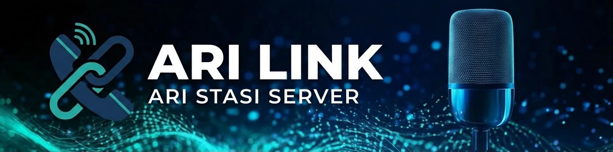
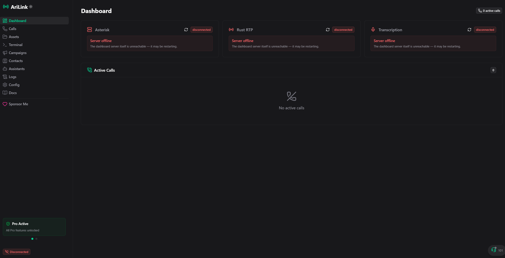
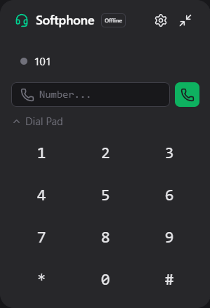
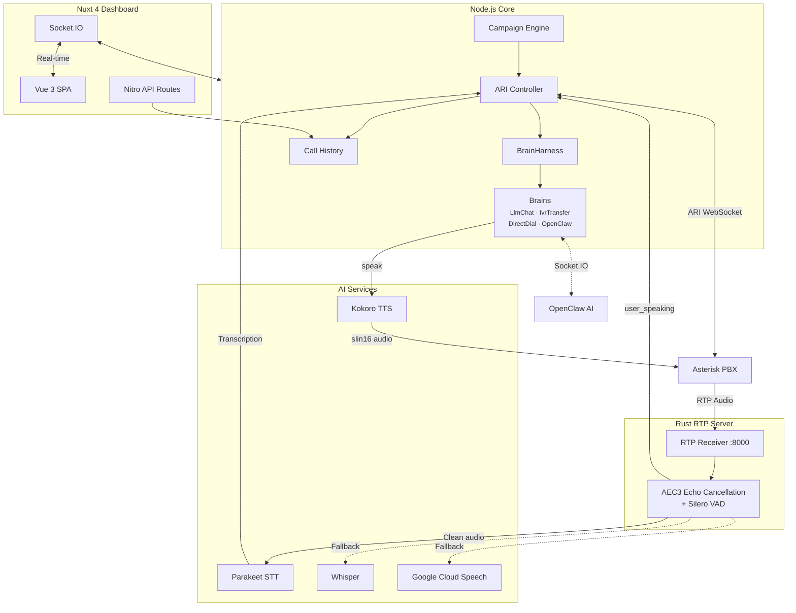

# AriLink

[](https://www.typescriptlang.org/)
[](https://nodejs.org/)
[](https://nuxt.com/)
[](https://wiki.asterisk.org/wiki/display/AST/Asterisk+REST+Interface+(ARI))
[](LICENSE)

<p align="center">
  
  <br>
  <em><a href="https://asterisk.org"></a>-powered telephony platform with real-time transcription, campaigns, and a full web dashboard</em>
</p>

---

## Overview

AriLink is a telephony platform built on Asterisk's ARI (Asterisk REST Interface). It combines a **Nuxt 4 web dashboard**, a **Rust RTP audio pipeline**, and **local AI transcription** into a single system for managing calls, running outbound campaigns, and monitoring everything in real time.

<p align="center">
  
</p>

## Key Features

- **LLM Voice Agent** - Full conversational AI via LlmChatBrain — streaming LLM responses with sentence-by-sentence TTS
- **Barge-In** - Interrupt bot speech mid-sentence. AEC3 echo cancellation + Silero VAD eliminate false triggers
- **Pluggable Brains** - Swap call logic via config: LLM Chat, IVR Transfer, Direct Dial, OpenClaw AI
- **Local TTS** - Text-to-speech via Kokoro (82M params) — zero API cost, ~100ms latency
- **Local STT** - Real-time transcription via Parakeet TDT (25 languages) or Whisper, with Google Cloud fallback
- **Web Dashboard** - Full management UI with real-time service status, active calls, logs, and configuration
- **Campaign Engine** - Automated outbound dialing with configurable concurrency and call scripts
- **OpenClaw Integration** - Bridge to OpenClaw AI agent ecosystem via Socket.IO
- **Call History** - SQLite-backed call records with search and transcription playback
- **CLI Tool** - `arilink init/start/stop/status/logs` for Docker deployments
- **Built-in Softphone** - SIP softphone directly in the dashboard for testing
- **SSH Terminal & File Manager** - Remote PBX management and audio file uploads via SFTP

<p align="center">
  
</p>

## Architecture

Built on **Nuxt 4 + Nitro** (single server for SPA, API, and Socket.IO), with a **Rust RTP server** for audio and **Python services** for transcription:



### Core Components

<details>
<summary><b>Engine</b></summary>

Orchestrates all backend services on startup:
- Starts the Rust RTP server and Parakeet transcription (in parallel)
- Connects to Asterisk ARI
- Wires up the Dashboard, Call History, and Campaign Engine
- Graceful shutdown of all child processes

</details>

<details>
<summary><b>ARI Controller</b></summary>

Interfaces with Asterisk PBX via ARI:
- Manages call flows, bridges, and DTMF input
- Delegates call logic to pluggable assistants
- Routes transcription results to active calls
- Handles contact lookups for voice-activated dialing

</details>

<details>
<summary><b>Rust RTP Server</b></summary>

High-performance audio pipeline with voice intelligence:
- Receives RTP audio from Asterisk ExternalMedia channels
- **AEC3 echo cancellation** — WebRTC-grade, 30-40dB attenuation with adaptive threshold
- **Silero VAD** — neural speech detection during TTS playback (barge-in trigger)
- **RMS gate** — filters noise below threshold before sending to STT
- Per-session audio routing with codec handling (slin16, Opus)
- Forwards clean audio to transcription services via WebSocket

</details>

<details>
<summary><b>Text-to-Speech (Kokoro)</b></summary>

Local TTS service for zero-latency, zero-cost speech synthesis:
- **Kokoro 82M** — lightweight neural TTS model
- Outputs 16kHz slin16 PCM directly for Asterisk playback
- Sentence-by-sentence streaming — start speaking before LLM finishes
- Configurable voice, speed, and language
- WebSocket protocol for low-latency communication

</details>

<details>
<summary><b>Transcription Providers</b></summary>

Multiple backend support with automatic failover:
- **Parakeet TDT 0.6B-v3** (recommended) — 25 languages, 2000x+ real-time speed, runs on GPU
- **Whisper** — Slower but highly accurate
- **Google Cloud Speech** — Cloud-based fallback (requires API credentials)
- Streaming transcription with interim and final results
- Priority chain configured via `TRANSCRIPTION_SERVICES` env var

</details>

<details>
<summary><b>Pluggable Brains</b></summary>

Modular call logic — swap behavior via `config.json` without changing code:
- **LlmChatBrain** — Full conversational AI (streaming LLM + sentence-by-sentence TTS + barge-in)
- **IvrTransferBrain** — DTMF gate → voice → contact match → transfer
- **DirectDialBrain** — Voice → contact match → direct transfer
- **OpenClawBrain** — Bridge to OpenClaw AI agent ecosystem
- **BrainHarness** — shared voice intelligence (filler filtering, turn debouncing, barge-in handling) benefits all brains automatically
- Create custom brains by implementing the `IBrain` interface

</details>

<details>
<summary><b>Campaign Engine</b></summary>

Automated outbound dialing:
- Upload phone lists and run campaigns from the dashboard
- Configurable concurrency, retry logic, and call scripts
- Real-time campaign progress via Socket.IO
- Per-call results stored in campaign-results/

</details>

### Dashboard Pages

| Page | Description |
|------|-------------|
| **Dashboard** | Service status (Asterisk, Rust RTP, Transcription), active calls |
| **Calls** | Call history with transcription, search, and playback |
| **Assets** | Upload/manage Asterisk audio files via SFTP |
| **Terminal** | SSH terminal for remote PBX management |
| **Campaigns** | Create and run outbound call campaigns |
| **Contacts** | Manage contacts for voice-activated dialing |
| **Assistants** | Configure call handling logic per assistant |
| **Logs** | Real-time and historical application logs |
| **Config** | Edit environment variables and server settings |
| **Docs** | Built-in documentation viewer |

## Getting Started

### Docker (Recommended)

The fastest way to try AriLink — no Node.js, Python, or Asterisk installation needed:

```bash
docker compose up -d
```

This starts 4 services: **Asterisk** (PBX), **Parakeet** (STT), **Kokoro** (TTS), and **AriLink** (dashboard + engine). Open [localhost:3011](http://localhost:3011).

**Test with a SIP phone** (Zoiper, Linphone): server `localhost:5060`, extension `1001`, password `demo1001`.

```bash
# With GPU acceleration (NVIDIA) — ~1000x faster STT + TTS
docker compose -f docker-compose.yml -f docker-compose.gpu.yml up -d

# With Rust RTP server (AEC3 echo cancellation + Silero VAD for barge-in)
docker compose --profile rust-rtp up -d

# With live code editing (mount local source)
docker compose -f docker-compose.yml -f docker-compose.dev.yml up -d
```

See [docs/docker.md](docs/docker.md) for full Docker guide, configuration, and troubleshooting.

### Manual Setup

For development or connecting to an existing FreePBX server:

#### Prerequisites

1. **Set up FreePBX server**:
   - New installation? [FreePBX Installation Guide](docs/freepbx-setup.md)
   - Already installed? [FreePBX ARI Configuration](docs/FREEPBX-ARI-CONFIGURATION.md)
2. **Node.js 23+** and **npm**
3. **UV** (Python package manager) for transcription services:
   ```powershell
   # Windows PowerShell
   irm https://astral.sh/uv/install.ps1 | iex
   ```

#### Installation

1. **Clone and install dependencies** (one command installs everything):
   ```bash
   npm install
   ```
   > This automatically installs both the core server and dashboard dependencies.

2. **Set up transcription** (local speech recognition):
   ```bash
   cd transcription-services/parakeet-service
   python -m venv .venv
   uv pip install -r requirements.txt
   ```

3. **Configure environment**:
   ```bash
   cp .env.example .env
   # Edit .env with your FreePBX IP, ARI credentials, etc.
   ```

#### Running

```bash
# Development (hot reload, auto-starts Parakeet if configured)
npm run dev

# Production (builds if needed, then starts)
npm start

# Build only
npm run build
```

> Set `AUTO_START_TRANSCRIPTION=true` in `.env` to have the launcher automatically start Parakeet in parallel with the server. No separate terminal needed.

The dashboard will be available at `http://localhost:3011`. All settings can be managed from the **Config** page once the server is running.

### Assistant Modes

```bash
npm run start:ivr        # IVR with transfer (default)
npm run start:dial       # Direct dial mode
npm run start:autodialer # Auto-dialer campaign mode
```

## Configuration

The system uses a central `.env` file. Key settings:

| Category | Variables |
|----------|-----------|
| **PBX** | `PBX_IP`, `ASTERISK_LOGIN`, `ASTERISK_PASSWORD` |
| **Transcription** | `TRANSCRIPTION_SERVICES`, `AUTO_START_TRANSCRIPTION`, `SPEECH_LANG` |
| **TTS** | `TTS_SERVICE`, `TTS_VOICE`, `TTS_SPEED`, `TTS_LANG` |
| **LLM** | `LLM_PROVIDER`, `LLM_MODEL`, `LLM_API_KEY`, `LLM_ENDPOINT` |
| **Rust RTP** | `USE_RUST_RTP`, `RUST_SERVER_URL` |
| **Server** | `PORT` (default 3011), `LISTENER_SERVER`, `EXTERNAL_HOST` |
| **Assistants** | `DEFAULT_ASSISTANT`, per-assistant `config.json` files |

See [`.env.example`](.env.example) for all options with documentation.

## Tech Stack

- **Frontend**: Nuxt 4, Vue 3.5, @nuxt/ui, Socket.IO client, SIP.js (softphone)
- **Backend**: Nitro (Node.js), TypeScript, Socket.IO, ari-client, better-sqlite3
- **Audio**: Rust RTP server with AEC3 echo cancellation + Silero VAD (slin16, Opus)
- **STT**: Parakeet TDT 0.6B-v3 (NeMo), Whisper, Google Cloud Speech
- **TTS**: Kokoro 82M (local, 16kHz slin16 output)
- **Infrastructure**: Asterisk PBX (FreePBX), Docker Compose, `arilink` CLI

## Roadmap

- ~~Web dashboard with live calls, campaigns, call history~~ **Done**
- ~~Local STT (Parakeet) + TTS (Kokoro) — zero API cost~~ **Done**
- ~~Pluggable brain architecture (BrainHarness + IBrain)~~ **Done**
- ~~LLM conversational voice agent (LlmChatBrain)~~ **Done**
- ~~Barge-in with AEC3 echo cancellation + Silero VAD~~ **Done**
- ~~Docker Compose + CLI tool~~ **Done**
- ~~OpenClaw AI integration~~ **Done**
- MCP tool use in LlmChatBrain (calendar, CRM, SMS)
- Call analytics and latency metrics
- WebRTC softphone improvements
- Additional STT providers: Deepgram, Azure Speech, ElevenLabs Scribe

See [docs/ROADMAP.md](docs/ROADMAP.md) for the full product roadmap.

## License

This project is licensed under the **AriLink Community License (ACL) v1.0** - see the [LICENSE](LICENSE) file for details.

- **Free for personal & internal use** - View, study, and modify for personal/internal use.
- **Commercial use restricted** - Internal commercial operations allowed; no redistribution or SaaS.
- **No Redistribution** - You may not redistribute, white-label, or sell the software.
- **Commercial Licensing**: For SaaS hosting, resale, or third-party deployment, contact Alexi Pawelec (Discord: `alexispace`).

---

<div align="center">
  <p>Built with care for modern telephony</p>
</div>
