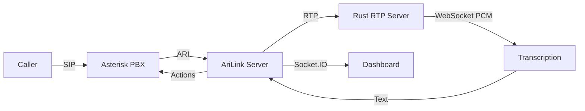

# System Overview

AriLink connects your Asterisk PBX to AI-powered voice assistants. When a call comes in (or goes out via a campaign), the system bridges audio to a transcription service, interprets what the caller says, and acts on it — transferring to a human, collecting data, or playing prompts.

## How It Works

## Core Concepts

| Concept | What it does |
|---------|-------------|
| **Incoming Calls** | Routed to an assistant based on extension or caller ID rules. The **Active Assistant** in Config is the fallback. |
| **Outbound Campaigns** | Auto-dialer calls a list of contacts using its own assistant — completely independent from incoming routing. |
| **Assistants** | Configurable AI behaviors: IVR menus, voice dial-by-name, campaign scripts. Each has its own prompts, timeouts, and logic. |
| **Transcription** | Real-time speech-to-text via Parakeet TDT (recommended) or Google Cloud Speech, with automatic fallback. |

::callout{type="tip"}
**New here?** Start with [Incoming Calls](/docs/incoming-calls) to understand how calls are handled, then check [Campaigns](/docs/campaigns) for outbound dialing.
::
