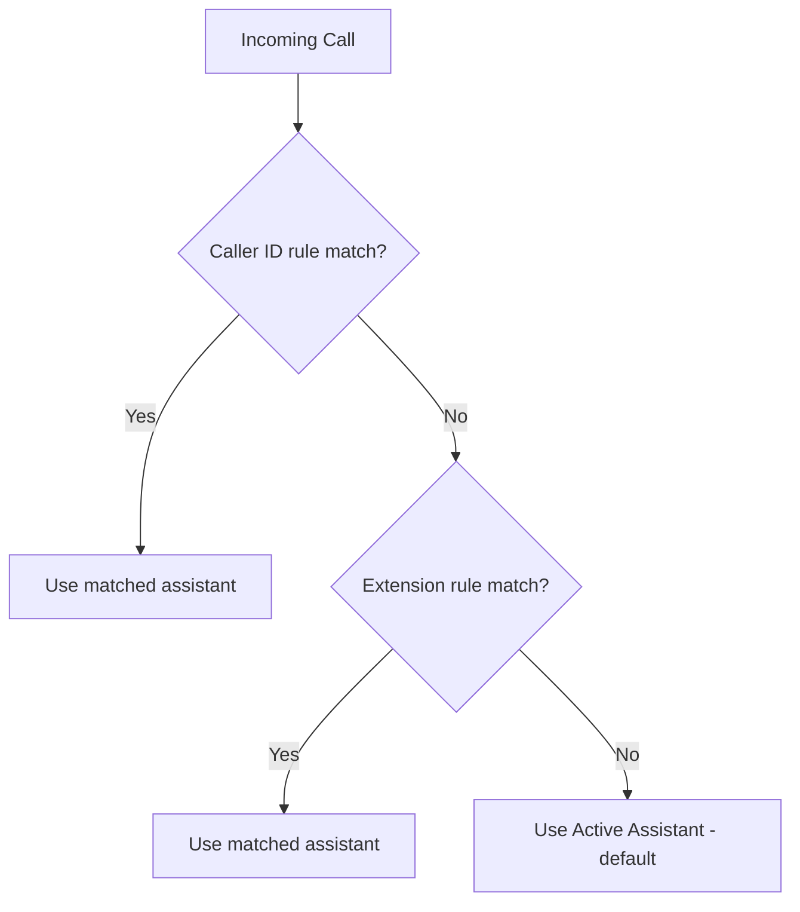

# Incoming Call Routing

When someone calls your PBX and the call reaches ARI, the system decides which assistant handles it.

## Routing Priority

1. **Caller ID rules** are checked first — if the caller's number matches a pattern, that assistant is used.
2. **Extension rules** are checked next — if the dialed extension matches a pattern, that assistant is used.
3. **Active Assistant** (Config page) is the fallback when no rule matches.

## When Do I Need Routing Rules?

Most setups only need the Active Assistant. Add rules when different extensions or caller IDs should get different AI behaviors.

**Example scenarios:**
- Extensions 100-109 → dial-by-name assistant
- Extensions 200-209 → IVR transfer assistant
- Campaign callback extension 201 → auto-dialer-call assistant

## Pattern Syntax

Patterns use JavaScript regular expressions:

| Pattern | Matches |
|---------|---------|
| `10[0-9]` | Extensions 100 through 109 |
| `20[0-9]` | Extensions 200 through 209 |
| `48\d{9}` | Polish phone numbers (48 + 9 digits) |
| `.*` | Anything (catch-all) |

::callout{type="info"}
Patterns are tested against the full string. `10[0-9]` matches exactly 100-109, not numbers that contain "10x" somewhere in them.
::

## Setting Up Rules

1. Go to **Config** page
2. Scroll to **Incoming Call Routing** section
3. Click **Add Rule**
4. Choose match type (Extension or Caller ID), enter pattern, select assistant
5. Click **Save**

Changes take effect immediately — the routing config is reloaded in-memory without restarting.
