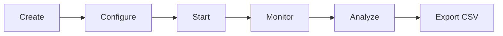

# Campaign Workflow

Campaigns auto-dial a list of phone numbers using an outbound assistant. The entire flow — from setup to analysis — happens in the Campaigns page.

## Step-by-step

1. **Go to Campaigns page** — fill in campaign name, caller ID, and select a contact list.
2. **Choose an assistant** — this is the AI that handles each outbound call (independent from incoming call settings).
3. **Set concurrency** — how many calls run in parallel (start low, e.g. 1-2).
4. **Start the campaign** — the auto-dialer begins calling. You can pause, resume, or stop at any time.
5. **Monitor progress** — the live results table shows each call's outcome.
6. **Analyze results** — view the result distribution chart and export data as CSV.

::callout{type="tip"}
**Campaign vs Incoming — they're separate.** Changing the Active Assistant in Config does not affect campaigns. Each campaign picks its own assistant in the wizard.
::

## Call Results

Each call in a campaign ends with one of these results:

| Result | Meaning |
|--------|---------|
| `answered` | Call was answered and conversation completed |
| `transferred` | Caller was transferred to a human agent |
| `no_interest` | Caller declined / not interested |
| `no_answer` | Phone rang but nobody picked up |
| `busy` | Line was busy |
| `failed` | Technical failure (network, PBX error, etc.) |

## Campaign History

Completed campaigns are saved as JSON files in `campaign-results/`. From the history table you can:

- **Export CSV** — download all call results as a spreadsheet
- **View Analytics** — expand to see result distribution bars and success rate
- **Relaunch** — pre-fill the wizard with the same settings for a new run

## Handling Callbacks

When people miss your campaign call and call back, they'll dial the number you used as caller ID. To route these callbacks correctly, see [Callbacks](/docs/callbacks).
