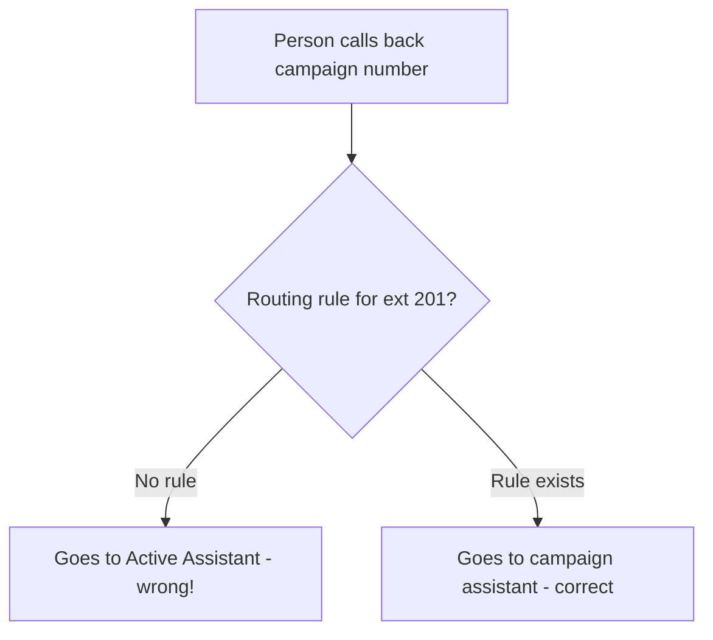

# Handling Campaign Callbacks

When you run an outbound campaign, some people won't answer but will call back later. They'll see your campaign's caller ID and dial it. Here's how to route those callbacks to the right assistant.

## The Problem

Without a routing rule, callbacks will be handled by whatever **Active Assistant** is set in Config — which is probably your IVR or dial-by-name assistant, not the campaign script.

## Setup

1. **Note your campaign caller ID** — e.g., you set the campaign to dial from extension `201`.
2. **Go to Config → Incoming Call Routing** and add an extension rule:
   - **Match:** Extension
   - **Pattern:** `201`
   - **Assistant:** `auto-dialer-call` (or whichever assistant should handle callbacks)
3. **Save routing** — now when someone calls back to extension 201, they get the campaign assistant instead of the default.

::callout{type="warning"}
You're matching by **extension** (the number they dialed into on your PBX), not by the caller's phone number. The extension is what your PBX sees as the destination.
::

## Multiple Campaigns

If you run different campaigns with different caller IDs, add a rule for each:

| Pattern | Assistant | Use case |
|---------|-----------|----------|
| `201` | auto-dialer-call | Sales campaign callbacks |
| `202` | ivr-transfer | Survey campaign callbacks |
| `203` | auto-dialer-call | Follow-up campaign callbacks |
