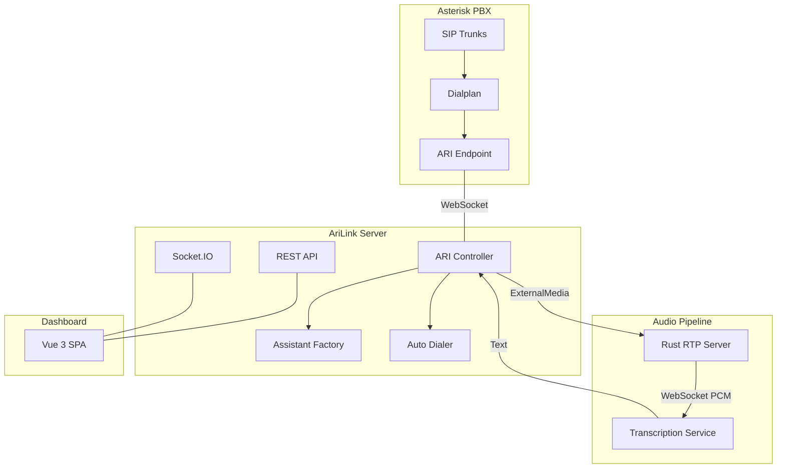
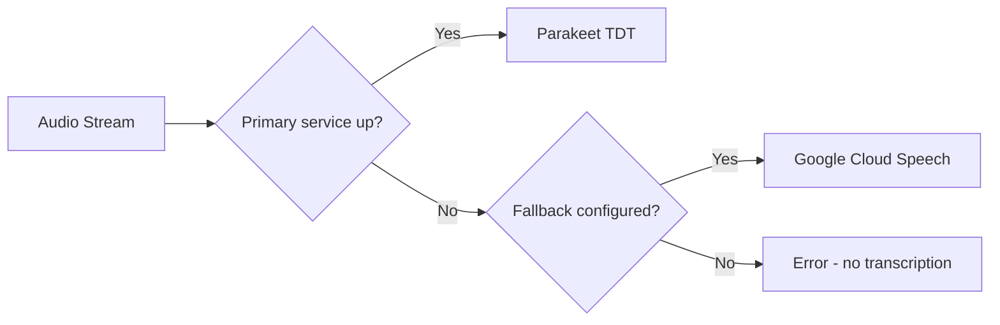

# Service Architecture

AriLink consists of several interconnected services that work together to handle voice calls with AI.

## Components

## Service Details

| Service | Technology | Purpose |
|---------|-----------|---------|
| **Nuxt/Nitro Server** | Node.js + TypeScript | Dashboard UI, REST API, Socket.IO, call orchestration |
| **ARI Connection** | ari-client (WebSocket) | Call control — answering, bridging, transferring, playing audio |
| **Rust RTP Server** | Rust binary | Receives raw RTP audio, converts to PCM, streams to transcription |
| **Transcription** | Parakeet TDT / Google Speech | Real-time speech-to-text via WebSocket |
| **Asterisk PBX** | FreePBX | SIP trunk management, extensions, audio routing |

## Data Flow

1. Caller dials in → **Asterisk** routes to ARI Stasis app
2. **ARI** notifies Node.js → assistant is selected (routing rules or default)
3. Audio is bridged to **Rust RTP server** → PCM stream to **transcription**
4. Transcription text flows back → assistant decides action (play audio, transfer, collect data)
5. Dashboard shows real-time status via **Socket.IO**

## Ports & Connections

| Service | Default Port | Protocol |
|---------|-------------|----------|
| Dashboard (Nuxt) | 3011 | HTTP/WS |
| Asterisk ARI | 8088 | HTTP/WS |
| Rust RTP | 9100 (control) | HTTP |
| Rust RTP | 10000-20000 (media) | UDP/RTP |
| Transcription (Parakeet) | 5000 | WebSocket |

## Transcription Fallback

Configure via `TRANSCRIPTION_SERVICES` env variable:
- `ws://localhost:5000` — Parakeet only
- `ws://localhost:5000,google` — Parakeet primary, Google fallback
- `ws://localhost:5000,ws://localhost:5001` — Two Parakeet instances
