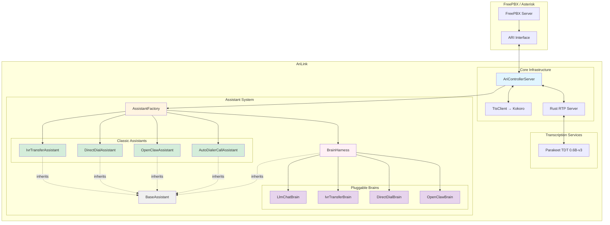
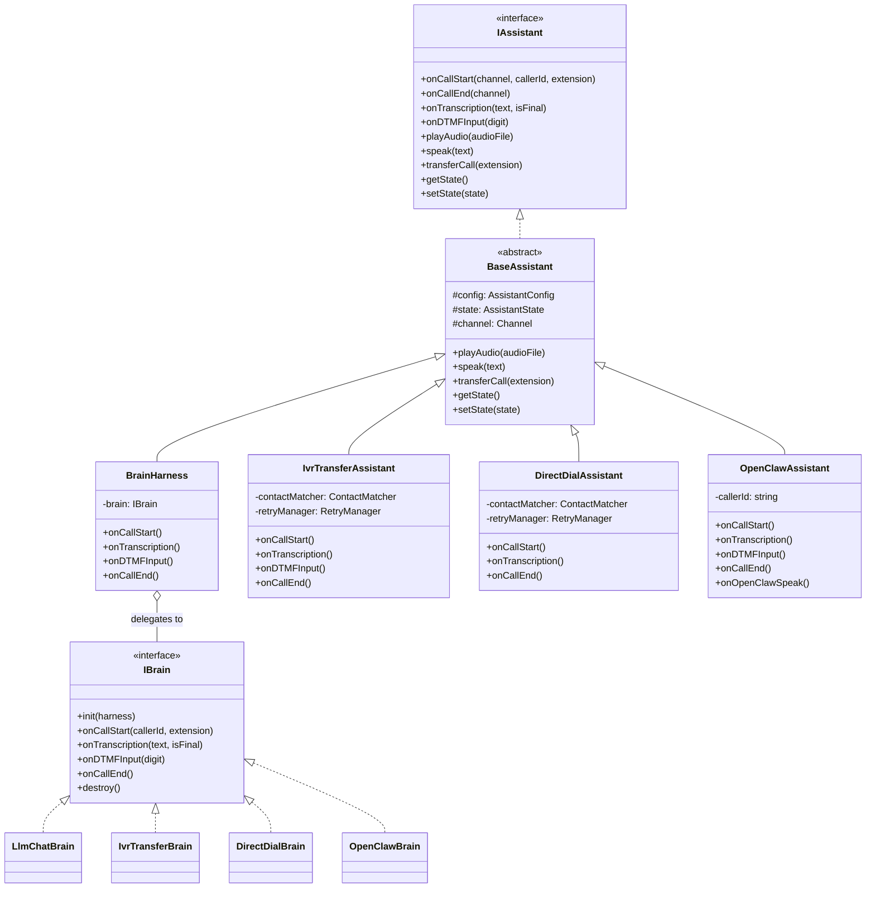
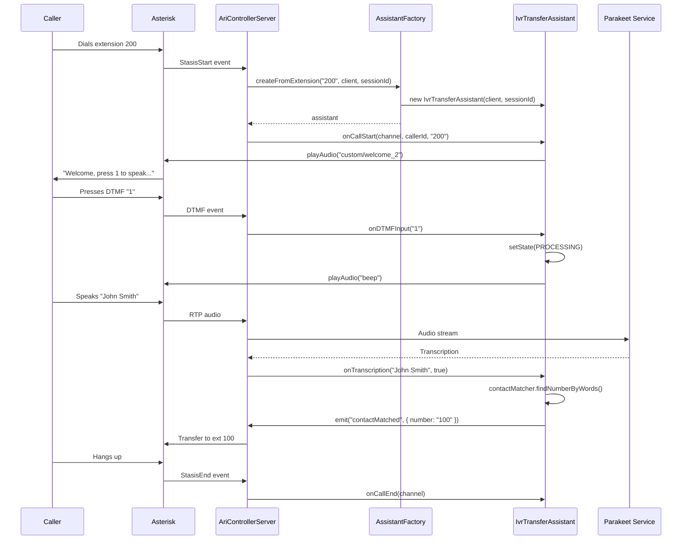
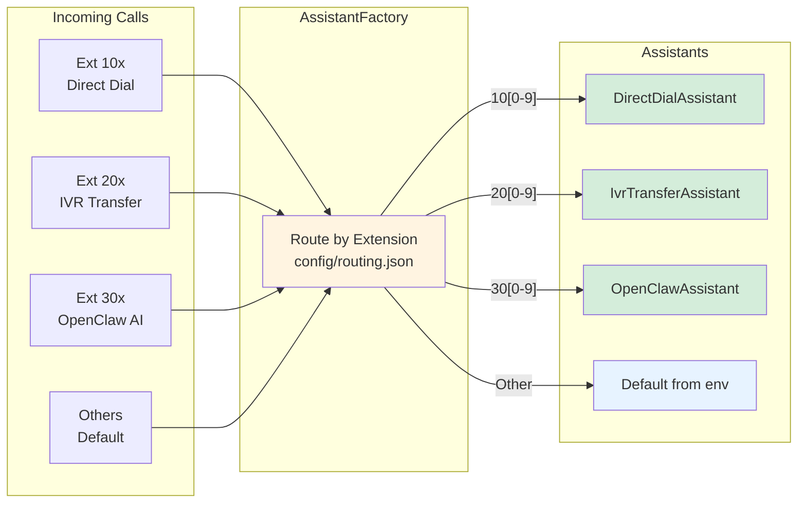
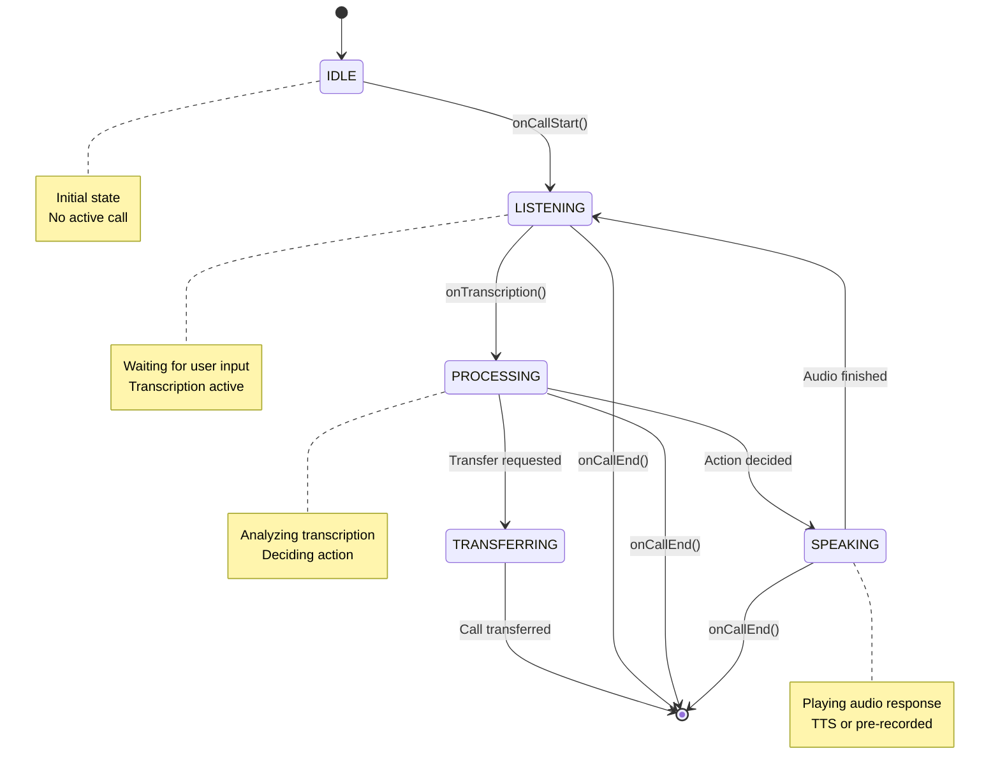

# 🤖 Assistant Architecture

Comprehensive guide to the modular assistant system for AriLink.

---

## 📋 Table of Contents

- [Overview](#overview)
- [Architecture Diagrams](#architecture-diagrams)
- [Components](#components)
- [Implementation Guide](#implementation-guide)
- [Creating Custom Assistants](#creating-custom-assistants)
- [Configuration](#configuration)
- [Examples](#examples)

---

## Overview

The assistant architecture separates **core infrastructure** (ARI communication, transcription) from **business logic** (how to respond to user input). This allows:

- ✅ **Multiple assistant types** - Customer service, sales, technical support, etc.
- ✅ **Easy customization** - Each assistant has its own behavior and prompts
- ✅ **Reusable code** - Common functionality in base classes
- ✅ **Flexible routing** - Different extensions → different assistants
- ✅ **Testable** - Mock interfaces for unit testing

---

## Architecture Diagrams

### 1. High-Level System Architecture



### 2. Assistant Class Hierarchy



### 3. Call Flow Sequence Diagram (IVR Transfer)



### 4. Extension-to-Assistant Routing



### 5. Assistant State Machine



---

## Components

### Directory Structure

```
arilink/
├── assistants/
│   ├── base/
│   │   ├── AssistantTypes.ts          # IAssistant, AssistantConfig, AssistantState
│   │   ├── BaseAssistant.ts           # Abstract base class (playAudio, setState, etc.)
│   │   ├── BrainTypes.ts              # IBrain, IBrainHarness interfaces
│   │   └── BrainHarness.ts            # Universal assistant that delegates to a brain
│   │
│   ├── brains/                        # Pluggable brain implementations
│   │   ├── LlmChatBrain.ts           # Streaming LLM + TTS conversational agent
│   │   ├── IvrTransferBrain.ts        # DTMF → voice → contact match → transfer
│   │   ├── DirectDialBrain.ts         # Voice → contact match → transfer
│   │   └── OpenClawBrain.ts           # Forward transcriptions to OpenClaw AI
│   │
│   ├── llm-chat/
│   │   └── config.json
│   │
│   ├── ivr-transfer/
│   │   ├── IvrTransferAssistant.ts    # Classic assistant (standalone)
│   │   └── config.json
│   │
│   ├── direct-dial/
│   │   ├── DirectDialAssistant.ts     # Classic assistant (standalone)
│   │   └── config.json
│   │
│   ├── openclaw/
│   │   ├── OpenClawAssistant.ts       # Classic assistant (standalone)
│   │   └── config.json
│   │
│   └── auto-dialer-call/
│       ├── AutoDialerCallAssistant.ts
│       └── config.json
│
├── core/
│   ├── AriControllerServer.ts         # Main controller, uses AssistantFactory
│   ├── AssistantFactory.ts            # Creates assistants (classic or brain-based)
│   ├── TtsClient.ts                   # WebSocket client for Kokoro TTS
│   ├── DashboardServer.ts             # Socket.IO hub for dashboard + OpenClaw
│   └── ...
│
├── config/
│   └── routing.json                   # Extension/CallerID → assistant routing rules
│
└── tts-services/
    └── kokoro-service/                # Text-to-Speech microservice
        ├── server.py
        ├── requirements.txt
        └── Dockerfile
```

---

## Two Creation Modes

AriLink supports two ways to create assistants. Both are backwards compatible.

### Mode 1: Classic Assistant (standalone class)

Each assistant is a class that extends `BaseAssistant` and embeds all its logic directly. This is the original approach.

```
AssistantFactory.createByType("ivr-transfer", client, sessionId)
  → loads assistants/ivr-transfer/IvrTransferAssistant.ts
  → new IvrTransferAssistant(client, sessionId)
```

### Mode 2: Brain + BrainHarness (pluggable)

The brain architecture separates **telephony plumbing** (BrainHarness) from **decision logic** (IBrain). A brain is a lightweight class that only handles call flow decisions.

```
config.json: { "brain": "openclaw" }

AssistantFactory.createByType("openclaw", client, sessionId)
  → reads config.json, sees "brain": "openclaw"
  → loads assistants/brains/OpenClawBrain.ts
  → new BrainHarness(config, client, sessionId, contacts, new OpenClawBrain())
```

### When to use which

| Use Case | Approach |
|----------|----------|
| Simple, self-contained logic | Classic assistant |
| Swappable behavior via config | Brain + BrainHarness |
| OpenClaw / AI integration | Brain (OpenClawBrain) |
| Same assistant folder, different brains | Brain (change `"brain"` in config.json) |

---

## Brain Architecture

### IBrain Interface

```typescript
// assistants/base/BrainTypes.ts
export interface IBrain {
  init(harness: IBrainHarness): void;
  onCallStart(callerId: string, extension: string): Promise<void>;
  onTranscription(text: string, isFinal: boolean): Promise<void>;
  onDTMFInput(digit: string): Promise<void>;
  onCallEnd(): Promise<void>;
  onSpeakingDone?(): void;   // Optional: called when TTS finishes
  destroy(): void;
}
```

### IBrainHarness API

Methods available to brains via `this.harness`:

| Method | Description |
|--------|-------------|
| `playAudio(file)` | Play pre-recorded audio (blocks until done) |
| `playAudioNoWait(file)` | Play audio without blocking |
| `playAudioWithFallback(file, fallback)` | Play audio, use fallback if missing |
| `speak(text)` | Synthesize text via TTS and play to caller |
| `transferCall(endpoint)` | Transfer the call |
| `hangup()` | Hang up the call |
| `setState(state)` | Set assistant state |
| `isState(state)` | Check current state |
| `emitEvent(event, data)` | Emit custom event (picked up by controller) |
| `cancelSpeaking()` | Cancel current speech (rejects pending speak() with BargeInError) |
| `sessionId` | Current session ID |
| `config` | Assistant configuration |
| `getContacts()` | Access the contacts database |

### Available Brains

| Brain | Slug | Flow |
|-------|------|------|
| LLM Chat | `llm-chat` | Welcome → listen → streaming LLM → sentence-by-sentence TTS → barge-in |
| IVR Transfer | `ivr-transfer` | Welcome → DTMF gate → voice → contact match → transfer |
| Direct Dial | `direct-dial` | Welcome → voice → contact match → transfer |
| OpenClaw | `openclaw` | Welcome → listen → forward to OpenClaw AI → TTS response |

### Creating a Custom Brain

1. Create `assistants/brains/MyCustomBrain.ts`:

```typescript
const { AssistantState } = require("../base/AssistantTypes");
import type { IBrain, IBrainHarness } from "../base/BrainTypes";

class MyCustomBrain implements IBrain {
  private harness!: IBrainHarness;

  init(harness: IBrainHarness): void {
    this.harness = harness;
  }

  async onCallStart(callerId: string, extension: string): Promise<void> {
    await this.harness.playAudio(this.harness.config.prompts.welcome);
    this.harness.setState(AssistantState.LISTENING);
  }

  async onTranscription(text: string, isFinal: boolean): Promise<void> {
    if (!isFinal) return;
    await this.harness.speak("I heard: " + text);
  }

  async onDTMFInput(digit: string): Promise<void> {}
  async onCallEnd(): Promise<void> {}
  destroy(): void {}
}

module.exports.MyCustomBrain = MyCustomBrain;
```

2. Use it in any assistant's `config.json`:

```json
{
  "name": "My Custom Assistant",
  "brain": "my-custom",
  "prompts": { "welcome": "custom/welcome" },
  "behavior": { "maxRetries": 3, "timeoutSeconds": 30, "silenceThresholdSeconds": 5 }
}
```

The slug is auto-derived from the filename: `MyCustomBrain.ts` → `"my-custom"`.

---

## Shared Voice Intelligence

BrainHarness provides voice-quality features that benefit **all brains** automatically, without any brain needing to implement them:

### Filler Sound Filtering

Non-word vocalizations (`um`, `uh`, `mm hmm`, `ah`, `oh`) are filtered before reaching the brain. This prevents brains from generating responses to meaningless sounds.

Real words like "yes", "hello", "ok" are **not** filtered — only genuine non-word vocalizations.

### Turn-End Debouncing

STT often sends multiple rapid-fire final transcriptions for a single utterance (e.g., `"I want to book a"` then `"dentist appointment"` as two finals). BrainHarness debounces these into a single brain call.

- Default debounce: `300ms` (configurable per-agent via `behavior.turnDebounceMs`)
- Post-barge-in debounce: `500ms` (captures full utterance after interruption)

### Barge-In Handling

When the user speaks during bot speech:

1. Rust RTP server detects speech via AEC3 + Silero VAD → fires `user_speaking` event
2. ARI Controller cancels TTS playback → calls `cancelSpeaking()` on BrainHarness
3. BrainHarness rejects pending `speak()` Promise with `BargeInError`
4. Brain's streaming loop catches `BargeInError` and aborts gracefully
5. BrainHarness notifies brain via `onBargeIn(text)` with the interrupting utterance
6. Extended debounce window (500ms) captures the full interrupting utterance

### Interim Transcription Passthrough

Interim (non-final) transcriptions bypass all filtering and debouncing, passing directly to the brain. This is needed by brains like OpenClawBrain that process interim results.

---

## Routing

### config/routing.json

```json
{
  "defaultAssistant": "ivr-transfer",
  "extensionRoutes": [
    { "pattern": "10[0-9]", "assistant": "direct-dial" },
    { "pattern": "20[0-9]", "assistant": "ivr-transfer" },
    { "pattern": "30[0-9]", "assistant": "openclaw" }
  ],
  "callerIdRoutes": [
    { "pattern": "\\+48.*", "assistant": "ivr-transfer" }
  ]
}
```

Patterns are regex. The factory tries routes in order, falls back to `defaultAssistant`.

### AssistantFactory Methods

```typescript
// Route by extension (reads routing.json)
AssistantFactory.createFromExtension("301", client, sessionId);
// → matches "30[0-9]" → creates openclaw assistant

// Route by caller ID
AssistantFactory.createFromCallerId("+48123456789", client, sessionId);

// Explicit type (bypasses routing.json)
AssistantFactory.createByType("openclaw", client, sessionId);

// Reload routing config after editing
AssistantFactory.reloadRouting();
```

### Dynamic Discovery

The factory automatically discovers assistants by scanning the `assistants/` directory. Any subfolder with a `*Assistant.ts` file is registered. Brains are discovered from `assistants/brains/*Brain.ts`. No imports or switch statements needed.

---

## Configuration

### Assistant config.json

Each assistant folder has a `config.json`:

```json
{
  "name": "IVR Transfer",
  "mode": "incoming",
  "brain": "ivr-transfer",
  "language": "en-US",
  "prompts": {
    "welcome": "custom/welcome_2",
    "goodbye": "custom/goodbye",
    "error": "custom/error",
    "timeout": "custom/timeout",
    "tryAgain": "custom/try_again"
  },
  "behavior": {
    "maxRetries": 12,
    "timeoutSeconds": 30,
    "silenceThresholdSeconds": 5,
    "transferDigit": "1",
    "maxNoMatches": 12,
    "tryAgainInterval": 3
  },
  "transfer": {
    "destination": "100",
    "trunk": "from-internal"
  }
}
```

| Field | Description |
|-------|-------------|
| `name` | Display name |
| `mode` | `"incoming"` or `"outbound"` |
| `brain` | Brain slug (optional — omit for classic assistant) |
| `language` | Speech recognition language |
| `prompts` | Audio file references (`sound:custom/...`) |
| `behavior` | Retry counts, timeouts, DTMF settings |
| `transfer` | Default transfer destination and trunk |
| `campaign` | Campaign settings (outbound only) |

### Environment Variables

```env
# Default assistant for unmatched extensions
DEFAULT_ASSISTANT=ivr-transfer

# TTS service (required for brains that use speak())
TTS_SERVICE=ws://localhost:5001
TTS_VOICE=af_heart
TTS_SPEED=1.0
```

---

## Related Documentation

- [OpenClaw Integration](OPENCLAW-INTEGRATION.md) — Connect AriLink to OpenClaw AI agents
- [Docker Setup](docker.md) — Run the full stack with Docker
- [FreePBX Setup](freepbx-setup.md) — FreePBX configuration
- [Dialplan Config](DIALPLAN-CONFIG.md) — Call routing setup
- [Transcription Services](TRANSCRIPTION-SERVICES.md) — Speech-to-text backends
