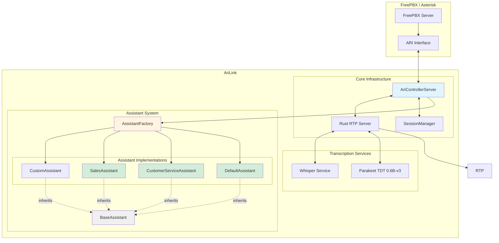
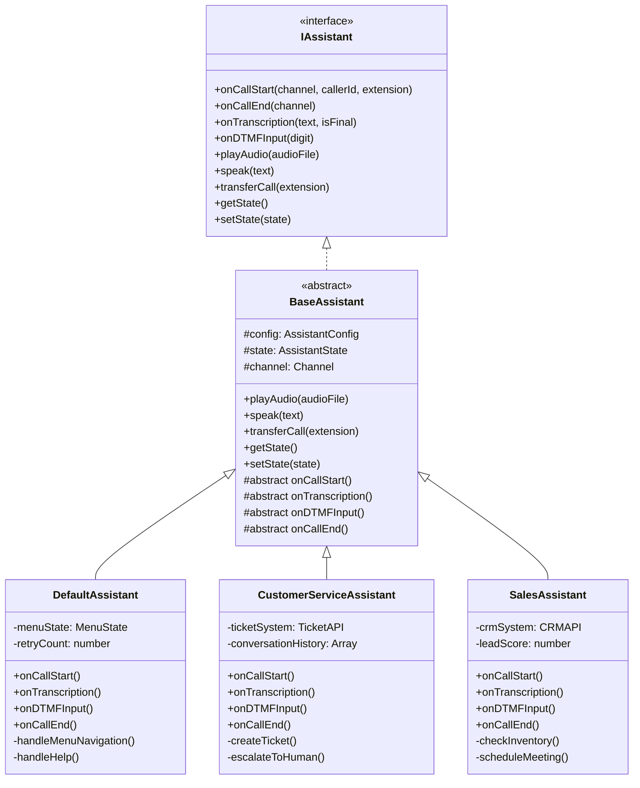
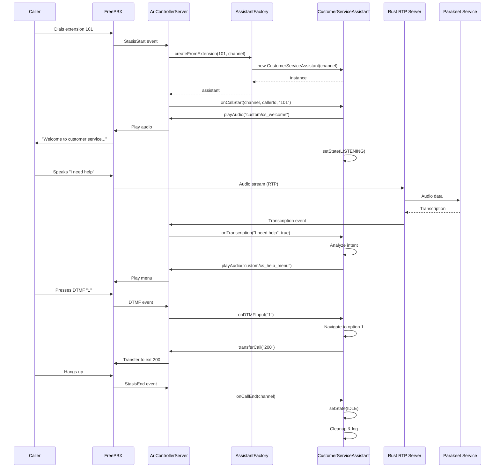
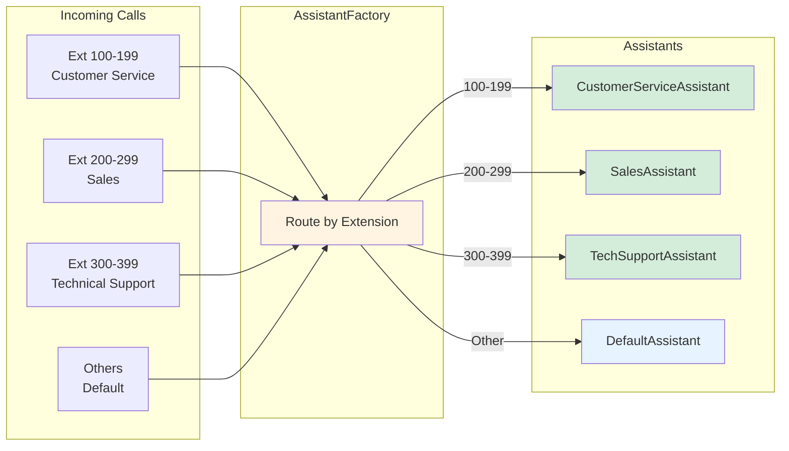
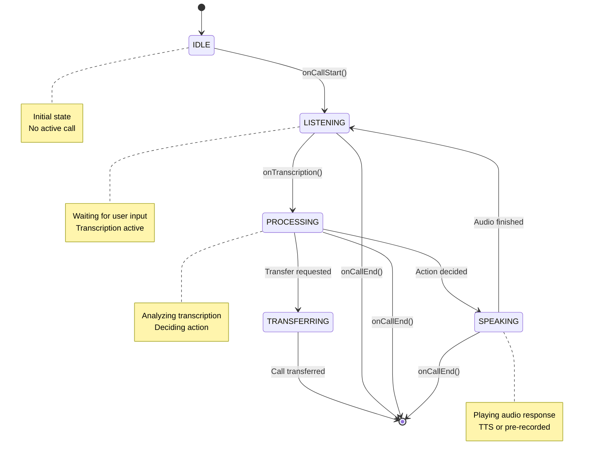

# 🤖 Assistant Architecture

Comprehensive guide to the modular assistant system for AriLink.

---

## 📋 Table of Contents

- [Overview](#overview)
- [Architecture Diagrams](#architecture-diagrams)
- [Components](#components)
- [Implementation Guide](#implementation-guide)
- [Creating Custom Assistants](#creating-custom-assistants)
- [Configuration](#configuration)
- [Examples](#examples)

---

## Overview

The assistant architecture separates **core infrastructure** (ARI communication, transcription) from **business logic** (how to respond to user input). This allows:

- ✅ **Multiple assistant types** - Customer service, sales, technical support, etc.
- ✅ **Easy customization** - Each assistant has its own behavior and prompts
- ✅ **Reusable code** - Common functionality in base classes
- ✅ **Flexible routing** - Different extensions → different assistants
- ✅ **Testable** - Mock interfaces for unit testing

---

## Architecture Diagrams

### 1. High-Level System Architecture



### 2. Assistant Class Hierarchy



### 3. Call Flow Sequence Diagram



### 4. Extension-to-Assistant Routing



### 5. Assistant State Machine



---

## Components

### 📁 Directory Structure

```
arilink/
├── assistants/
│   ├── base/
│   │   ├── AssistantInterface.ts      # Interface definition
│   │   ├── BaseAssistant.ts           # Abstract base class
│   │   └── AssistantTypes.ts          # Common types & enums
│   │
│   ├── default/
│   │   ├── DefaultAssistant.ts        # Default assistant
│   │   └── config.json                # Configuration
│   │
│   ├── customer-service/
│   │   ├── CustomerServiceAssistant.ts
│   │   └── config.json
│   │
│   ├── sales/
│   │   ├── SalesAssistant.ts
│   │   └── config.json
│   │
│   └── README.md
│
├── core/
│   ├── AriControllerServer.ts         # Uses AssistantFactory
│   ├── AssistantFactory.ts            # Creates assistants
│   └── ...
│
└── docs/
    └── ASSISTANT-ARCHITECTURE.md      # This file
```

---

## Implementation Guide

### Step 1: Create Base Interface

**File:** `assistants/base/AssistantInterface.ts`

```typescript
export interface IAssistant {
  // Lifecycle hooks
  onCallStart(channel: any, callerId: string, extension: string): Promise<void>;
  onCallEnd(channel: any): Promise<void>;

  // Input handlers
  onTranscription(text: string, isFinal: boolean): Promise<void>;
  onDTMFInput(digit: string): Promise<void>;

  // Actions
  playAudio(audioFile: string): Promise<void>;
  speak(text: string): Promise<void>;
  transferCall(extension: string): Promise<void>;
  hangup(): Promise<void>;

  // State management
  getState(): AssistantState;
  setState(state: AssistantState): void;
}

export enum AssistantState {
  IDLE = "idle",
  LISTENING = "listening",
  PROCESSING = "processing",
  SPEAKING = "speaking",
  TRANSFERRING = "transferring"
}

export interface AssistantConfig {
  name: string;
  language: string;
  prompts: {
    welcome: string;
    goodbye: string;
    error: string;
    timeout: string;
  };
  behavior: {
    maxRetries: number;
    timeoutSeconds: number;
    silenceThresholdSeconds: number;
  };
}
```

### Step 2: Create Base Class

**File:** `assistants/base/BaseAssistant.ts`

```typescript
import { IAssistant, AssistantConfig, AssistantState } from './AssistantInterface';

export abstract class BaseAssistant implements IAssistant {
  protected config: AssistantConfig;
  protected state: AssistantState = AssistantState.IDLE;
  protected channel: any;
  protected ari: any; // ARI client reference

  constructor(config: AssistantConfig, ari: any) {
    this.config = config;
    this.ari = ari;
  }

  // Common functionality
  async playAudio(audioFile: string): Promise<void> {
    return new Promise((resolve, reject) => {
      this.channel.play(
        { media: `sound:${audioFile}` },
        (err: any, playback: any) => {
          if (err) return reject(err);
          playback.once('PlaybackFinished', () => resolve());
        }
      );
    });
  }

  async speak(text: string): Promise<void> {
    // TODO: Integrate TTS service
    console.log(`[Assistant] Speaking: ${text}`);
  }

  async transferCall(extension: string): Promise<void> {
    console.log(`[Assistant] Transferring to ${extension}`);
    // Implement transfer logic using ARI
  }

  async hangup(): Promise<void> {
    this.channel.hangup((err: any) => {
      if (err) console.error('Hangup error:', err);
    });
  }

  getState(): AssistantState {
    return this.state;
  }

  setState(state: AssistantState): void {
    console.log(`[Assistant] State: ${this.state} → ${state}`);
    this.state = state;
  }

  // Abstract methods - must be implemented by subclasses
  abstract onCallStart(channel: any, callerId: string, extension: string): Promise<void>;
  abstract onTranscription(text: string, isFinal: boolean): Promise<void>;
  abstract onDTMFInput(digit: string): Promise<void>;
  abstract onCallEnd(channel: any): Promise<void>;
}
```

### Step 3: Create Assistant Factory

**File:** `core/AssistantFactory.ts`

```typescript
import { IAssistant } from '../assistants/base/AssistantInterface';
import { DefaultAssistant } from '../assistants/default/DefaultAssistant';
import { CustomerServiceAssistant } from '../assistants/customer-service/CustomerServiceAssistant';
import { SalesAssistant } from '../assistants/sales/SalesAssistant';

export class AssistantFactory {
  /**
   * Create assistant based on extension routing
   */
  static createFromExtension(extension: string, channel: any, ari: any): IAssistant {
    const ext = parseInt(extension);

    // Route by extension range
    if (ext >= 100 && ext < 200) {
      return new CustomerServiceAssistant(channel, ari);
    } else if (ext >= 200 && ext < 300) {
      return new SalesAssistant(channel, ari);
    } else {
      return new DefaultAssistant(channel, ari);
    }
  }

  /**
   * Create assistant by explicit type
   */
  static createByType(type: string, channel: any, ari: any): IAssistant {
    switch (type.toLowerCase()) {
      case 'customer-service':
      case 'cs':
        return new CustomerServiceAssistant(channel, ari);

      case 'sales':
        return new SalesAssistant(channel, ari);

      case 'default':
      default:
        return new DefaultAssistant(channel, ari);
    }
  }

  /**
   * Create assistant based on caller ID (VIP routing, etc.)
   */
  static createFromCallerId(callerId: string, channel: any, ari: any): IAssistant {
    // Check if VIP customer
    if (this.isVIPCustomer(callerId)) {
      return new CustomerServiceAssistant(channel, ari); // Priority routing
    }

    return new DefaultAssistant(channel, ari);
  }

  private static isVIPCustomer(callerId: string): boolean {
    // TODO: Check database or CRM
    return false;
  }
}
```

### Step 4: Update AriControllerServer

**File:** `core/AriControllerServer.ts` (modifications)

```typescript
import { AssistantFactory } from './AssistantFactory';
import { IAssistant } from '../assistants/base/AssistantInterface';

class AriController {
  private assistants: Map<string, IAssistant> = new Map();

  handleStasisStart(event: any, channel: any) {
    const { args } = event;
    const [extension, callerId] = args;

    console.log(`[AriController] New call: ${callerId} → ${extension}`);

    // Create appropriate assistant
    const assistant = AssistantFactory.createFromExtension(
      extension,
      channel,
      this.ari
    );

    // Store assistant for this channel
    this.assistants.set(channel.id, assistant);

    // Let assistant handle call start
    assistant.onCallStart(channel, callerId, extension);
  }

  handleTranscription(channelId: string, text: string, isFinal: boolean) {
    const assistant = this.assistants.get(channelId);
    if (assistant) {
      assistant.onTranscription(text, isFinal);
    }
  }

  handleDTMF(channelId: string, digit: string) {
    const assistant = this.assistants.get(channelId);
    if (assistant) {
      assistant.onDTMFInput(digit);
    }
  }

  handleStasisEnd(event: any, channel: any) {
    const assistant = this.assistants.get(channel.id);
    if (assistant) {
      assistant.onCallEnd(channel);
      this.assistants.delete(channel.id);
    }
  }
}
```

---

## Creating Custom Assistants

### Example: Customer Service Assistant

**File:** `assistants/customer-service/CustomerServiceAssistant.ts`

```typescript
import { BaseAssistant } from '../base/BaseAssistant';
import { AssistantState } from '../base/AssistantInterface';
import config from './config.json';

export class CustomerServiceAssistant extends BaseAssistant {
  private conversationHistory: string[] = [];
  private ticketId: string | null = null;

  constructor(channel: any, ari: any) {
    super(config, ari);
    this.channel = channel;
  }

  async onCallStart(channel: any, callerId: string, extension: string): Promise<void> {
    console.log(`[CS Assistant] Starting call from ${callerId}`);

    // Play welcome message
    await this.playAudio(this.config.prompts.welcome);

    // Start listening
    this.setState(AssistantState.LISTENING);
  }

  async onTranscription(text: string, isFinal: boolean): Promise<void> {
    if (!isFinal) return;

    console.log(`[CS Assistant] User said: ${text}`);
    this.conversationHistory.push(`User: ${text}`);

    this.setState(AssistantState.PROCESSING);

    // Intent recognition
    const intent = this.recognizeIntent(text);

    switch (intent) {
      case 'help':
        await this.handleHelp();
        break;

      case 'complaint':
        await this.handleComplaint();
        break;

      case 'transfer':
        await this.transferToHuman();
        break;

      default:
        await this.handleUnknown();
    }

    this.setState(AssistantState.LISTENING);
  }

  async onDTMFInput(digit: string): Promise<void> {
    console.log(`[CS Assistant] DTMF: ${digit}`);

    if (digit === '0') {
      await this.transferToHuman();
    }
  }

  async onCallEnd(channel: any): Promise<void> {
    console.log(`[CS Assistant] Call ended`);

    // Save conversation log
    if (this.ticketId) {
      this.saveConversation();
    }

    this.setState(AssistantState.IDLE);
  }

  // Private helper methods
  private recognizeIntent(text: string): string {
    const lower = text.toLowerCase();

    if (lower.includes('help') || lower.includes('assist')) {
      return 'help';
    }
    if (lower.includes('complaint') || lower.includes('problem')) {
      return 'complaint';
    }
    if (lower.includes('speak') || lower.includes('human') || lower.includes('operator')) {
      return 'transfer';
    }

    return 'unknown';
  }

  private async handleHelp(): Promise<void> {
    this.setState(AssistantState.SPEAKING);
    await this.playAudio('custom/cs_help_menu');
  }

  private async handleComplaint(): Promise<void> {
    this.ticketId = this.createTicket();
    this.setState(AssistantState.SPEAKING);
    await this.speak(`I've created ticket ${this.ticketId} for your issue.`);
  }

  private async transferToHuman(): Promise<void> {
    this.setState(AssistantState.TRANSFERRING);
    await this.speak("Transferring you to a customer service representative.");
    await this.transferCall('300'); // Transfer to CS queue
  }

  private async handleUnknown(): Promise<void> {
    this.setState(AssistantState.SPEAKING);
    await this.playAudio(this.config.prompts.error);
  }

  private createTicket(): string {
    // TODO: Integrate with ticketing system
    return `CS-${Date.now()}`;
  }

  private saveConversation(): void {
    // TODO: Save to database
    console.log('[CS Assistant] Saving conversation:', this.conversationHistory);
  }
}
```

### Configuration File

**File:** `assistants/customer-service/config.json`

```json
{
  "name": "Customer Service Assistant",
  "language": "en-US",
  "prompts": {
    "welcome": "custom/cs_welcome",
    "goodbye": "custom/cs_goodbye",
    "error": "custom/cs_error",
    "timeout": "custom/cs_timeout"
  },
  "behavior": {
    "maxRetries": 3,
    "timeoutSeconds": 30,
    "silenceThresholdSeconds": 5
  }
}
```

---

## Configuration

### Environment Variables

Add to `.env`:

```env
# Assistant Configuration
DEFAULT_ASSISTANT=default
ASSISTANT_ROUTING=extension-based  # Options: extension-based, caller-id-based, config-based

# Extension → Assistant Routing
ASSISTANT_EXT_100_199=customer-service
ASSISTANT_EXT_200_299=sales
ASSISTANT_EXT_300_399=technical-support
```

---

## Examples

### Routing Scenarios

#### Scenario 1: Extension-Based Routing

```typescript
// Caller dials extension 105
const assistant = AssistantFactory.createFromExtension('105', channel, ari);
// Returns: CustomerServiceAssistant (100-199 range)
```

#### Scenario 2: Type-Based Routing

```typescript
// Explicitly create sales assistant
const assistant = AssistantFactory.createByType('sales', channel, ari);
// Returns: SalesAssistant
```

#### Scenario 3: Caller ID Based Routing

```typescript
// VIP customer calls
const assistant = AssistantFactory.createFromCallerId('+15551234567', channel, ari);
// Returns: CustomerServiceAssistant (priority routing)
```

---

## 📚 Related Documentation

- [FreePBX Setup](freepbx-setup.md) - FreePBX configuration
- [Dialplan Config](DIALPLAN-CONFIG.md) - Call routing setup
- [Transcription Services](TRANSCRIPTION-SERVICES.md) - Speech-to-text backends

---

## 💡 Best Practices

1. **Keep assistants focused** - One assistant = one purpose
2. **Use configuration files** - Don't hardcode prompts and behavior
3. **Log conversations** - Essential for debugging and improving
4. **Handle errors gracefully** - Always have fallback responses
5. **Test thoroughly** - Mock the interface for unit tests
6. **Document intents** - Keep a list of supported commands per assistant
7. **Monitor performance** - Track response times and user satisfaction

---

**Need help?** Check the [FreePBX community forums](https://community.freepbx.org/) or open an issue on GitHub.
