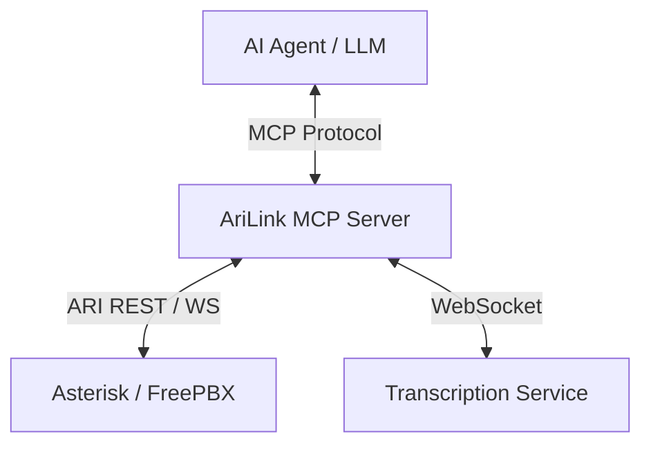

# 🤖 AriLink MCP Server Integration Plan

The **Model Context Protocol (MCP)** integration turns AriLink from a standalone app into a **plugin for AI Agents**. This allows an LLM (like Claude or Gemini) to "see" active phone calls and control them via standardized tools.

---

## 🏗️ Architecture

## 🛠️ Proposed MCP Tools

| Tool Name | Description | Parameters |
| :--- | :--- | :--- |
| `list_active_calls` | Shows all current channels and bridges. | None |
| `originate_call` | Starts a new call to an extension or number. | `endpoint`, `callerId`, `appArgs` |
| `play_prompt` | Plays a WAV file to a channel. | `channelId`, `mediaName` |
| `transfer_call` | Bridges an existing call to a new destination. | `channelId`, `destination` |
| `get_transcription` | Returns the real-time text of an active call. | `channelId`, `last_n_lines` |
| `hangup_call` | Ends a specific call. | `channelId`, `reason` |

## 🌟 Use Cases for an AI Agent

### 1. AI-Guided Routing
The agent listens to the start of a call, looks up the caller's history in a CRM tool (if also connected via MCP), and then uses `transfer_call` to send the caller to the specific specialist they need.

### 2. Live "Call Whisperer"
An AI agent can monitor calls in real-time. If it detects a "frustrated" sentiment via `get_transcription`, it can notify a human supervisor on Slack or via an internal tool.

### 3. Automated Outbound Campaigns
An AI can use `originate_call` to follow up on web form leads. If the person answers, the AI has a real conversation using the tools to interact.

---

## 🚀 Implementation Roadmap

1. **Phase 1: Tool Definitions**
   - Create a new `core/MCPServer.ts` using the `@modelcontextprotocol/sdk`.
   - Map existing `AriControllerServer` methods to MCP tools.

2. **Phase 2: Event Streaming**
   - Implement MCP "Resources" for real-time transcription.
   - The AI can "subscribe" to a call's transcription resource.

3. **Phase 3: Integration Testing**
   - Use the **MCP Inspector** to verify that calls can be initiated and monitored via the chat interface.

---

## 💡 Why this is a "Killer Feature"
Standard PBX systems are "dumb" boxes. By adding an MCP layer, you are making telephony **Agent-Ready**. You are building a system where the "Brains" (the LLM) interact with the "Voice" (the PBX) via a clean, structured protocol.
